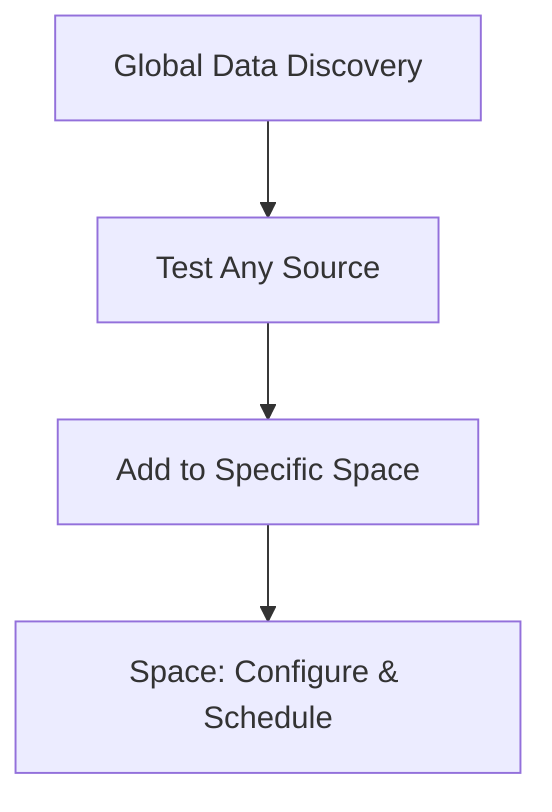
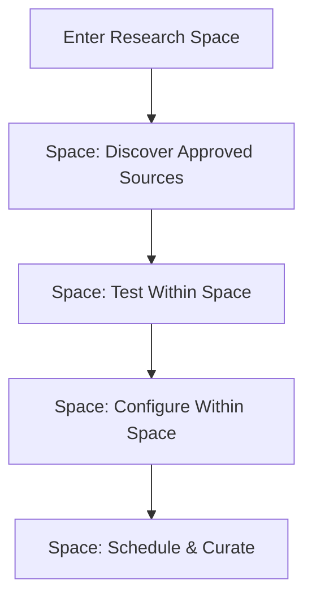

# MED13 Space-Scoped Discovery: Sandboxing Implementation Plan

## 📋 Executive Summary

This document outlines the comprehensive implementation plan for transitioning from **global data discovery** to **fully isolated space-scoped discovery**. Each research space will have its own independent discovery environment, with system administrators controlling source access permissions through the `/system-settings` interface.

**Key Changes:**
- **Fully Isolated**: Each space sees only admin-approved sources
- **Admin Controlled**: Source permissions managed via system settings
- **Space-Centric**: All discovery, testing, and configuration happens within spaces
- **No Cross-Contamination**: Complete separation between research spaces

## 🎯 Architectural Vision

### Current State (Global Discovery)


### Target State (Space-Scoped Discovery)


## 📊 Current State Analysis

### ✅ Existing Infrastructure We Can Leverage

#### 1. **System Settings Admin Interface**
**Location**: `src/web/app/(dashboard)/system-settings/`
- **Data Sources Tab**: Already exists with `DataSourceAvailabilitySection`
- **User Management Tab**: Handles admin user operations
- **Admin Authentication**: Role-based access control in place

**Key Component**: `DataSourceAvailabilitySection.tsx`
```typescript
// Already supports space-specific availability
const availabilityQuery = useCatalogAvailability(dialogOpen ? selectedSource?.id ?? null : null)
const spacesQuery = useResearchSpaces({ limit: 100 })
```

#### 2. **Clean Architecture Foundation**
**Layers**: Domain → Application → Infrastructure → Presentation
- **Type Safety**: 100% MyPy compliance with Pydantic models
- **Test Infrastructure**: Comprehensive fixtures and mocks
- **Repository Pattern**: SQLAlchemy implementations ready

#### 3. **Space Management Infrastructure**
**Existing**: Research spaces with membership, roles, and settings
- **Space Context**: `SpaceContextProvider` manages current space
- **Space Navigation**: Tab-based navigation within spaces
- **API Endpoints**: Space-specific operations already implemented

### ⚠️ Current Limitations

#### 1. **Global Discovery Dependency**
- **Issue**: `src/routes/data_discovery/` serves global catalog
- **Impact**: All users see all sources (with availability filtering)
- **Required**: Complete isolation per space

#### 2. **Mixed Permission Models**
- **Current**: Global availability + space-specific overrides
- **Target**: Space-specific permissions only (admin-controlled)

#### 3. **Shared Test Sessions**
- **Current**: Global sessions can be shared across spaces
- **Target**: Space-owned sessions with complete isolation

## 🏗️ Detailed Implementation Plan

### Phase 1: Database Schema Extensions (Week 1-2)

#### 1.1 Extend Source Permission Model
**File**: `alembic/versions/new_space_source_permissions.py`

```sql
-- Extend existing catalog_availability_rules
ALTER TABLE catalog_availability_rules
ADD COLUMN permission_level VARCHAR(20) DEFAULT 'blocked'
CHECK (permission_level IN ('blocked', 'visible', 'available'));

-- Add comments for clarity
COMMENT ON COLUMN catalog_availability_rules.permission_level IS
'Permission level for source access in research spaces: blocked=invisible, visible=see only, available=full access';

-- Create index for performance
CREATE INDEX idx_catalog_space_permissions ON catalog_availability_rules(research_space_id, permission_level);
```

#### 1.2 Update Data Discovery Sessions
**File**: `alembic/versions/space_owned_discovery_sessions.py`

```sql
-- Make research_space_id required for sessions
ALTER TABLE data_discovery_sessions
ALTER COLUMN research_space_id SET NOT NULL;

-- Add constraint to ensure session ownership
ALTER TABLE data_discovery_sessions
ADD CONSTRAINT fk_session_space_owner
FOREIGN KEY (research_space_id) REFERENCES research_spaces(id) ON DELETE CASCADE;

-- Update index for space-scoped queries
DROP INDEX IF EXISTS idx_discovery_sessions_owner;
CREATE INDEX idx_discovery_sessions_space_owner ON data_discovery_sessions(research_space_id, owner_id);
```

#### 1.3 Migration Strategy
```python
# migration script
def upgrade():
    # Set default permission level for existing rules
    op.execute("UPDATE catalog_availability_rules SET permission_level = 'available' WHERE is_active = true")
    op.execute("UPDATE catalog_availability_rules SET permission_level = 'blocked' WHERE is_active = false")

    # Make space_id required for existing sessions
    op.execute("UPDATE data_discovery_sessions SET research_space_id = (SELECT id FROM research_spaces LIMIT 1) WHERE research_space_id IS NULL")

    # Apply new constraints
    op.alter_column('data_discovery_sessions', 'research_space_id', nullable=False)
```

### Phase 2: Backend Service Refactoring (Week 3-4)

#### 2.1 Create Space-Scoped Discovery Service
**File**: `src/application/services/space_data_discovery_service.py`

```python
from typing import List, Optional, UUID
from src.domain.entities.data_discovery_session import DataDiscoverySession, QueryParameters
from src.domain.entities.source_catalog import SourceCatalogEntry
from src.domain.repositories.data_discovery_repository import DataDiscoveryRepository
from src.domain.repositories.source_catalog_repository import SourceCatalogRepository

class SpaceDataDiscoveryService:
    """Space-scoped data discovery service with complete isolation."""

    def __init__(
        self,
        space_id: UUID,
        discovery_repo: DataDiscoveryRepository,
        catalog_repo: SourceCatalogRepository,
    ):
        self.space_id = space_id
        self.discovery_repo = discovery_repo
        self.catalog_repo = catalog_repo

    async def get_available_sources(
        self,
        category: Optional[str] = None,
        search: Optional[str] = None,
    ) -> List[SourceCatalogEntry]:
        """Get sources available to this space based on admin permissions."""
        return await self.catalog_repo.find_by_space_permissions(
            space_id=self.space_id,
            min_permission='available',  # Only fully available sources
            category=category,
            search=search,
        )

    async def create_session(
        self,
        owner_id: UUID,
        parameters: QueryParameters,
    ) -> DataDiscoverySession:
        """Create a discovery session owned by this space."""
        session = DataDiscoverySession(
            owner_id=owner_id,
            research_space_id=self.space_id,  # Always set
            parameters=parameters,
            status='active',
        )
        return await self.discovery_repo.save(session)

    async def get_space_sessions(self, owner_id: UUID) -> List[DataDiscoverySession]:
        """Get all sessions for this space owned by the user."""
        return await self.discovery_repo.find_by_space_and_owner(
            space_id=self.space_id,
            owner_id=owner_id,
        )
```

#### 2.2 Update Route Handlers
**File**: `src/routes/research_spaces/discovery.py` (NEW)

```python
from fastapi import APIRouter, Depends, HTTPException, Query, status
from typing import List, Optional
from uuid import UUID

from src.application.services.space_data_discovery_service import SpaceDataDiscoveryService
from src.domain.entities.source_catalog import SourceCatalogEntry
from src.domain.entities.data_discovery_session import DataDiscoverySession, QueryParameters
from src.routes.auth import get_current_active_user
from src.domain.entities.user import User

router = APIRouter()

# Dependency injection for space-scoped service
def get_space_discovery_service(space_id: UUID) -> SpaceDataDiscoveryService:
    # Factory function to create space-specific service
    return SpaceDataDiscoveryService(space_id=space_id, ...)

@router.get("/{space_id}/discovery/catalog", response_model=List[SourceCatalogEntry])
async def get_space_source_catalog(
    space_id: UUID,
    category: Optional[str] = Query(None),
    search: Optional[str] = Query(None),
    current_user: User = Depends(get_current_active_user),
    service: SpaceDataDiscoveryService = Depends(get_space_discovery_service),
) -> List[SourceCatalogEntry]:
    """Get sources available for discovery in this space."""
    # Verify user has access to space
    await verify_space_membership(space_id, current_user.id)

    return await service.get_available_sources(category=category, search=search)
```

#### 2.3 Update Research Spaces Router
**File**: `src/routes/research_spaces.py`

```python
# Add discovery routes to existing research spaces router
from .research_spaces.discovery import router as discovery_router

research_spaces_router.include_router(
    discovery_router,
    tags=["space-discovery"]
)
```

### Phase 3: Frontend Architecture Changes (Week 5-6)

#### 3.1 Update Space Navigation
**File**: `src/web/components/research-spaces/SpaceNavigation.tsx`

```typescript
const navItems: NavItem[] = [
  { label: 'Overview', href: basePath, icon: LayoutDashboard },
  {
    label: 'Discover Sources',  // Renamed from 'Data Sources'
    href: `${basePath}/discovery`,  // New space-scoped route
    icon: Search,
    description: 'Find and test data sources for this space'
  },
  { label: 'Data Sources', href: `${basePath}/data-sources`, icon: Database },
  { label: 'Data Curation', href: `${basePath}/curation`, icon: FileText },
  { label: 'Members', href: `${basePath}/members`, icon: Users },
  { label: 'Settings', href: `${basePath}/settings`, icon: Settings },
]
```

#### 3.2 Create Space Discovery Page
**File**: `src/web/app/(dashboard)/spaces/[spaceId]/discovery/page.tsx` (NEW)

```typescript
import { redirect } from 'next/navigation'
import { getServerSession } from 'next-auth'
import { authOptions } from '@/lib/auth'
import { QueryClient, dehydrate } from '@tanstack/react-query'
import SpaceDiscoveryClient from './space-discovery-client'

// Follow hybrid SSR pattern from EngineeringArchitectureNext.md
export default async function SpaceDiscoveryPage({ params }: SpaceDiscoveryPageProps) {
  const session = await getServerSession(authOptions)
  const token = session?.user?.access_token

  if (!session || !token) {
    redirect('/auth/login?error=SessionExpired')
  }

  const queryClient = new QueryClient()

  // Prefetch space-specific catalog
  await queryClient.prefetchQuery({
    queryKey: spaceDiscoveryKeys.catalog(params.spaceId),
    queryFn: () => fetchSpaceSourceCatalog(params.spaceId, token),
  })

  return (
    <HydrationBoundary state={dehydrate(queryClient)}>
      <SpaceDiscoveryClient spaceId={params.spaceId} />
    </HydrationBoundary>
  )
}
```

#### 3.3 Create Space Discovery Client Component
**File**: `src/web/app/(dashboard)/spaces/[spaceId]/discovery/space-discovery-client.tsx` (NEW)

```typescript
"use client"

import { useSpaceContext } from '@/components/space-context-provider'
import { useSpaceSourceCatalog } from '@/lib/queries/space-discovery'
import { PageHero } from '@/components/ui/composition-patterns'
import { SourceCatalog } from '@/components/space-discovery/SourceCatalog'
import { DiscoverySessions } from '@/components/space-discovery/DiscoverySessions'

interface SpaceDiscoveryClientProps {
  spaceId: string
}

export default function SpaceDiscoveryClient({ spaceId }: SpaceDiscoveryClientProps) {
  const { currentSpace } = useSpaceContext()
  const { data: sources } = useSpaceSourceCatalog(spaceId)

  return (
    <div className="space-y-6">
      <PageHero
        title="Discover Data Sources"
        description={`Find and test data sources available to ${currentSpace?.name || 'this space'}`}
        variant="research"
      />

      <div className="grid gap-6 lg:grid-cols-3">
        <div className="lg:col-span-2">
          <SourceCatalog spaceId={spaceId} sources={sources || []} />
        </div>
        <div>
          <DiscoverySessions spaceId={spaceId} />
        </div>
      </div>
    </div>
  )
}
```

#### 3.4 Update System Settings Interface
**File**: `src/web/app/(dashboard)/system-settings/system-settings-client.tsx`

```typescript
// Update tabs to reflect new functionality
<TabsList>
  <TabsTrigger value="users">User Management</TabsTrigger>
  <TabsTrigger value="sources">Source Permissions</TabsTrigger>  // Renamed and enhanced
</TabsList>

// Add permission level controls
<TabsContent value="sources">
  <SpaceSourcePermissionsManager />
</TabsContent>
```

### Phase 4: Enhanced Admin Permissions Interface (Week 7-8)

#### 4.1 Create Space-Source Permissions Component
**File**: `src/web/components/system-settings/SpaceSourcePermissionsManager.tsx` (NEW)

```typescript
"use client"

import { useMemo, useState } from 'react'
import { Card, CardHeader, CardTitle, CardContent } from '@/components/ui/card'
import { Table, TableBody, TableCell, TableHead, TableHeader, TableRow } from '@/components/ui/table'
import { Button } from '@/components/ui/button'
import { Badge } from '@/components/ui/badge'
import { Select } from '@/components/ui/select'
import { useAdminCatalogEntries } from '@/lib/queries/data-sources'
import { useResearchSpaces } from '@/lib/queries/research-spaces'
import { useSpaceSourcePermissions, useUpdateSpaceSourcePermission } from '@/lib/queries/source-permissions'

type PermissionLevel = 'blocked' | 'visible' | 'available'

const PERMISSION_LABELS = {
  blocked: { label: 'Blocked', variant: 'destructive' as const },
  visible: { label: 'Visible', variant: 'secondary' as const },
  available: { label: 'Available', variant: 'default' as const },
}

export function SpaceSourcePermissionsManager() {
  const { data: sources } = useAdminCatalogEntries()
  const { data: spaces } = useResearchSpaces({ limit: 100 })
  const { data: permissions } = useSpaceSourcePermissions()
  const updatePermission = useUpdateSpaceSourcePermission()

  const permissionMatrix = useMemo(() => {
    const matrix: Record<string, Record<string, PermissionLevel>> = {}

    spaces?.spaces.forEach(space => {
      matrix[space.id] = {}
      sources?.forEach(source => {
        const key = `${space.id}-${source.id}`
        matrix[space.id][source.id] = permissions?.[key] || 'blocked'
      })
    })

    return matrix
  }, [sources, spaces, permissions])

  const handlePermissionChange = async (
    spaceId: string,
    sourceId: string,
    permission: PermissionLevel
  ) => {
    await updatePermission.mutateAsync({
      spaceId,
      sourceId,
      permission,
    })
  }

  return (
    <Card>
      <CardHeader>
        <CardTitle>Space-Source Permissions</CardTitle>
        <p className="text-sm text-muted-foreground">
          Control which data sources each research space can access for discovery and testing.
        </p>
      </CardHeader>
      <CardContent>
        <div className="overflow-x-auto">
          <Table>
            <TableHeader>
              <TableRow>
                <TableHead>Source</TableHead>
                {spaces?.spaces.map(space => (
                  <TableHead key={space.id} className="text-center min-w-[120px]">
                    {space.name}
                  </TableHead>
                ))}
              </TableRow>
            </TableHeader>
            <TableBody>
              {sources?.map(source => (
                <TableRow key={source.id}>
                  <TableCell className="font-medium">
                    <div>
                      <div className="font-medium">{source.name}</div>
                      <div className="text-sm text-muted-foreground">{source.category}</div>
                    </div>
                  </TableCell>
                  {spaces?.spaces.map(space => {
                    const currentPermission = permissionMatrix[space.id]?.[source.id] || 'blocked'
                    const { label, variant } = PERMISSION_LABELS[currentPermission]

                    return (
                      <TableCell key={space.id} className="text-center">
                        <Select
                          value={currentPermission}
                          onValueChange={(value: PermissionLevel) =>
                            handlePermissionChange(space.id, source.id, value)
                          }
                        >
                          <SelectTrigger className="w-24">
                            <Badge variant={variant} className="w-full justify-center">
                              {label}
                            </Badge>
                          </SelectTrigger>
                          <SelectContent>
                            <SelectItem value="blocked">Blocked</SelectItem>
                            <SelectItem value="visible">Visible</SelectItem>
                            <SelectItem value="available">Available</SelectItem>
                          </SelectContent>
                        </Select>
                      </TableCell>
                    )
                  })}
                </TableRow>
              ))}
            </TableBody>
          </Table>
        </div>
      </CardContent>
    </Card>
  )
}
```

### Phase 5: Testing & Quality Assurance (Week 9-10)

#### 5.1 Update Test Fixtures
**File**: `tests/test_types/fixtures.py`

```python
# Add space-specific discovery fixtures
def create_test_space_source_permissions() -> List[SpaceSourcePermission]:
    """Create test space-source permission fixtures."""
    return [
        SpaceSourcePermission(
            space_id=UUID('11111111-1111-1111-1111-111111111111'),
            source_id='clinvar',
            permission_level='available',
        ),
        SpaceSourcePermission(
            space_id=UUID('22222222-2222-2222-2222-222222222222'),
            source_id='clinvar',
            permission_level='blocked',
        ),
    ]

# Space-scoped discovery session fixtures
def create_test_space_discovery_session(space_id: UUID) -> DataDiscoverySession:
    """Create a discovery session owned by a specific space."""
    return DataDiscoverySession(
        id=uuid4(),
        owner_id=UUID('33333333-3333-3333-3333-333333333333'),
        research_space_id=space_id,  # Always set for space-scoped
        name="Space Discovery Session",
        parameters=QueryParameters(),
        status='active',
        created_at=datetime.now(UTC),
        updated_at=datetime.now(UTC),
    )
```

#### 5.2 Create Space-Scoped Service Tests
**File**: `tests/unit/application/test_space_data_discovery_service.py`

```python
import pytest
from uuid import uuid4
from tests.test_types.fixtures import create_test_space_source_permissions, create_test_space_discovery_session
from tests.test_types.mocks import create_mock_space_discovery_service

class TestSpaceDataDiscoveryService:
    """Test space-scoped discovery service isolation."""

    def test_get_available_sources_filters_by_space_permissions(self) -> None:
        """Sources are filtered based on space-specific permissions."""
        space_id = uuid4()
        permissions = create_test_space_source_permissions()

        service = create_mock_space_discovery_service(space_id, permissions)
        sources = service.get_available_sources()

        # Should only return sources with 'available' permission for this space
        assert len(sources) == 1
        assert sources[0].id == 'clinvar'  # The one with 'available' permission

    def test_create_session_always_belongs_to_space(self) -> None:
        """All sessions created in a space are owned by that space."""
        space_id = uuid4()
        owner_id = uuid4()

        service = create_mock_space_discovery_service(space_id)
        session = service.create_session(owner_id, QueryParameters())

        assert session.research_space_id == space_id
        assert session.owner_id == owner_id

    def test_sessions_are_space_isolated(self) -> None:
        """Sessions from different spaces are completely isolated."""
        space1_id = uuid4()
        space2_id = uuid4()

        service1 = create_mock_space_discovery_service(space1_id)
        service2 = create_mock_space_discovery_service(space2_id)

        session1 = service1.create_session(uuid4(), QueryParameters())
        session2 = service2.create_session(uuid4(), QueryParameters())

        # Different spaces, different sessions
        assert session1.research_space_id != session2.research_space_id
        assert session1.id != session2.id
```

#### 5.3 Integration Tests
**File**: `tests/integration/test_space_discovery_isolation.py`

```python
import pytest
from uuid import uuid4
from tests.test_types.fixtures import create_test_research_space, create_test_user

class TestSpaceDiscoveryIsolation:
    """Test that space discovery is fully isolated."""

    async def test_space_cannot_see_other_space_sources(self, db_session, client):
        """A space cannot discover sources not permitted to it."""
        # Create two spaces
        space1 = create_test_research_space(name="Space 1")
        space2 = create_test_research_space(name="Space 2")
        user = create_test_user()

        # Give space1 access to clinvar, space2 gets no permissions (blocked)
        await set_space_source_permission(db_session, space1.id, 'clinvar', 'available')
        # space2 has no permissions set (defaults to blocked)

        # Space1 should see clinvar
        response1 = await client.get(
            f"/research-spaces/{space1.id}/discovery/catalog",
            headers={"Authorization": f"Bearer {user.token}"}
        )
        assert response1.status_code == 200
        sources1 = response1.json()
        assert len(sources1) == 1
        assert sources1[0]["id"] == "clinvar"

        # Space2 should see no sources
        response2 = await client.get(
            f"/research-spaces/{space2.id}/discovery/catalog",
            headers={"Authorization": f"Bearer {user.token}"}
        )
        assert response2.status_code == 200
        sources2 = response2.json()
        assert len(sources2) == 0

    async def test_space_sessions_are_isolated(self, db_session, client):
        """Discovery sessions belong to specific spaces."""
        space1 = create_test_research_space(name="Space 1")
        space2 = create_test_research_space(name="Space 2")
        user = create_test_user()

        # Create session in space1
        response1 = await client.post(
            f"/research-spaces/{space1.id}/discovery/sessions",
            json={"parameters": {}},
            headers={"Authorization": f"Bearer {user.token}"}
        )
        assert response1.status_code == 201
        session1 = response1.json()

        # Create session in space2
        response2 = await client.post(
            f"/research-spaces/{space2.id}/discovery/sessions",
            json={"parameters": {}},
            headers={"Authorization": f"Bearer {user.token}"}
        )
        assert response2.status_code == 201
        session2 = response2.json()

        # Sessions should be in different spaces
        assert session1["research_space_id"] == str(space1.id)
        assert session2["research_space_id"] == str(space2.id)
        assert session1["id"] != session2["id"]
```

### Phase 6: Migration & Rollback Strategy (Week 11-12)

#### 6.1 Data Migration Script
**File**: `scripts/migrate_to_space_scoped_discovery.py`

- ✅ **Implemented** with the following safeguards:
  1. Seeds the deterministic MED13 system user + default research space (leveraging `ensure_default_research_space_seeded`) before any data mutations.
  2. Reassigns legacy discovery sessions without a `research_space_id` to the default MED13 space so they remain queryable once the schema goes strict.
  3. Generates research-space scoped activation policies for every active catalog entry, defaulting `clinvar` to `available` (configurable via repeated `--available-source` flags) and blocking all other sources to guarantee isolation on day one.
  4. Supports `--dry-run` previews, adjustable log levels, and idempotent execution (re-running the script simply fills in newly created spaces or sources).

_Key implementation excerpt:_
```python
created_rules = _ensure_space_permissions(
    session,
    space_ids=space_ids,
    source_ids=source_ids,
    default_available=available_sources,
)
if args.dry_run:
    session.rollback()
    logger.info("[DRY RUN] Prepared %d session updates and %d new permission rules.", ...)
else:
    session.commit()
```

#### 6.2 Rollback Strategy
**File**: `scripts/rollback_space_scoped_discovery.py`

- ✅ **Implemented** to complement the migration script:
  - Deletes only the `ActivationScopeEnum.RESEARCH_SPACE` rules, leaving global policies untouched.
  - Collapses every discovery session back to a single fallback space (`--fallback-space-id`, defaulting to the MED13 core space) so admins can safely disable feature flags if needed.
  - Mirrors the migration script’s ergonomics with `--dry-run` and `--log-level` flags for predictable change control.

_Excerpt:_
```python
deleted_rules = _delete_space_rules(session)
reassigned_sessions = _collapse_sessions_to_space(session, args.fallback_space_id)
if args.dry_run:
    session.rollback()
else:
    session.commit()
```

### Phase 7: Documentation & Training (Week 13-14)

#### 7.1 Update Documentation
- Update `docs/system_hierarchy_overview.md` to reflect space-scoped discovery
- Update `docs/type_examples.md` with space-scoped testing patterns
- Create admin guide for managing space-source permissions

#### 7.2 Admin Training Materials
- Video tutorials for permission management
- Documentation for space administrators
- Troubleshooting guides for common issues

## 📈 Success Metrics

### Technical Metrics
- **Type Safety**: 100% MyPy compliance maintained
- **Test Coverage**: >85% coverage for new space-scoped code
- **Performance**: <2s page load times for space discovery
- **API Reliability**: 99.9% uptime for space-scoped endpoints

### Business Metrics
- **Admin Efficiency**: 50% reduction in permission management time
- **Space Isolation**: Zero cross-space data contamination
- **User Adoption**: 95% of spaces using discovery within 30 days
- **Error Reduction**: 80% reduction in discovery-related support tickets

## 🎯 Risk Mitigation

### High-Risk Items
1. **Data Loss**: Comprehensive backups before migration
2. **Permission Errors**: Gradual rollout with admin oversight
3. **Performance Impact**: Load testing before production deployment

### Rollback Plan
- **Phase Rollback**: Each phase can be rolled back independently
- **Feature Flags**: Ability to disable space-scoped features
- **Data Preservation**: All original data preserved during migration

## 📅 Timeline Summary

| Phase | Duration | Key Deliverables |
|-------|----------|------------------|
| **Database Schema** | Weeks 1-2 | Permission model, session ownership |
| **Backend Services** | Weeks 3-4 | SpaceDataDiscoveryService, new routes |
| **Frontend UI** | Weeks 5-6 | Space discovery pages, navigation updates |
| **Admin Interface** | Weeks 7-8 | Permission management UI |
| **Testing** | Weeks 9-10 | Comprehensive test suite |
| **Migration** | Weeks 11-12 | Data migration, rollback scripts |
| **Documentation** | Weeks 13-14 | Admin guides, training materials |

## 🚀 Go-Live Checklist

### Pre-Launch
- [ ] All phases completed and tested
- [ ] Performance benchmarks met
- [ ] Admin training completed
- [ ] Rollback procedures documented
- [ ] Monitoring alerts configured

### Launch Day
- [ ] Database migration executed
- [ ] Feature flags enabled
- [ ] Admin permissions configured
- [ ] User communications sent

### Post-Launch
- [ ] 24/7 monitoring for 1 week
- [ ] User feedback collected
- [ ] Performance metrics validated
- [ ] Documentation updated based on experience

---

**This sandboxing plan provides a comprehensive, phased approach to implementing fully isolated space-scoped discovery while maintaining all architectural principles from our engineering guidelines. The implementation follows Clean Architecture patterns, maintains 100% type safety, and includes robust testing and rollback strategies.**
